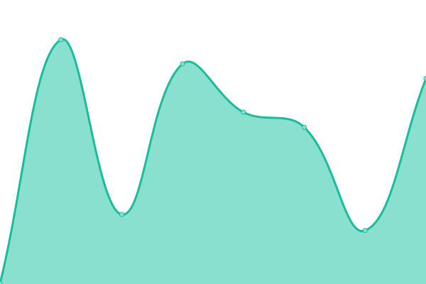
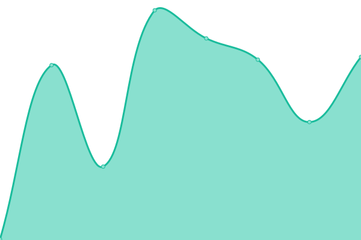
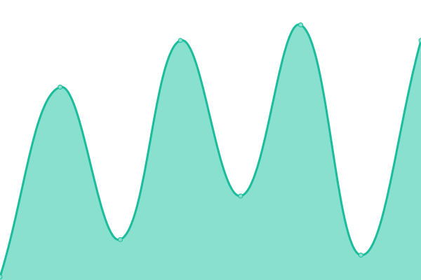
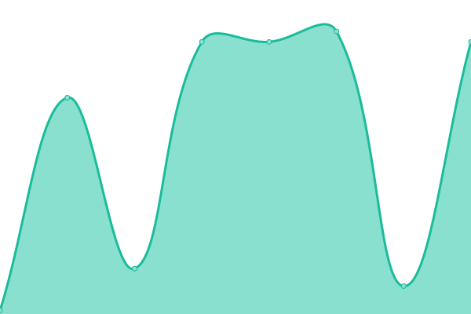

# [📈 Live Status](https://status.unitedgamingalliance.com): <!--live status--> **🟩 All systems operational**

This repository contains the open-source uptime monitor and status page for [Matto MC](mgmc.au), powered by [Upptime](https://github.com/upptime/upptime).

With [Upptime](https://upptime.js.org), you can get your own unlimited and free uptime monitor and status page, powered entirely by a GitHub repository. We use [Issues](https://github.com/mattomc/ugaupptime/issues) as incident reports, [Actions](https://github.com/mattomc/ugaupptime/actions) as uptime monitors, and [Pages](https://status.unitedgamingalliance.com) for the status page.

<!--start: status pages-->
<!-- This summary is generated by Upptime (https://github.com/upptime/upptime) -->
<!-- Do not edit this manually, your changes will be overwritten -->
<!-- prettier-ignore -->
| URL | Status | History | Response Time | Uptime |
| --- | ------ | ------- | ------------- | ------ |
|  [San Andreas First Responders [Community Management Panel]](https://cms.safrgaming.com) | 🟩 Up | [san-andreas-first-responders-community-management-panel.yml](https://github.com/mattomc/ugaupptime/commits/HEAD/history/san-andreas-first-responders-community-management-panel.yml) | 

 338ms
     
 | 

<a href="https://status.unitedgamingalliance.com/history/san-andreas-first-responders-community-management-panel">100.00%</a>
    

|  [United Gaming Alliance](https://forum.unitedgamingalliance.com) | 🟩 Up | [united-gaming-alliance.yml](https://github.com/mattomc/ugaupptime/commits/HEAD/history/united-gaming-alliance.yml) | 

 387ms
     
 | 

<a href="https://status.unitedgamingalliance.com/history/united-gaming-alliance">100.00%</a>
    

|  [United Gaming Alliance Virtual Airline](https://va.unitedgamingalliance.com) | 🟩 Up | [united-gaming-alliance-virtual-airline.yml](https://github.com/mattomc/ugaupptime/commits/HEAD/history/united-gaming-alliance-virtual-airline.yml) | 

 242ms
     
 | 

<a href="https://status.unitedgamingalliance.com/history/united-gaming-alliance-virtual-airline">100.00%</a>
    

|  [Minecraft](149.28.42.129) | 🟩 Up | [minecraft.yml](https://github.com/mattomc/ugaupptime/commits/HEAD/history/minecraft.yml) | 

 49ms
     
 | 

<a href="https://status.unitedgamingalliance.com/history/minecraft">97.66%</a>
    

|  [7D2D](149.28.42.129) | 🟩 Up | [7-d2-d.yml](https://github.com/mattomc/ugaupptime/commits/HEAD/history/7-d2-d.yml) | 

 57ms
     
 | 

<a href="https://status.unitedgamingalliance.com/history/7-d2-d">100.00%</a>
    

<!--end: status pages-->

[**Visit our status website →**](https://status.unitedgamingalliance.com)

## 📄 License

- Powered by: [Upptime](https://github.com/upptime/upptime)
- Code: [MIT](./LICENSE) © [Anand Chowdhary](https://anandchowdhary.com), supported by [Pabio](https://pabio.com)
- Data in the `./history` directory: [Open Database License](https://opendatacommons.org/licenses/odbl/1-0/)
